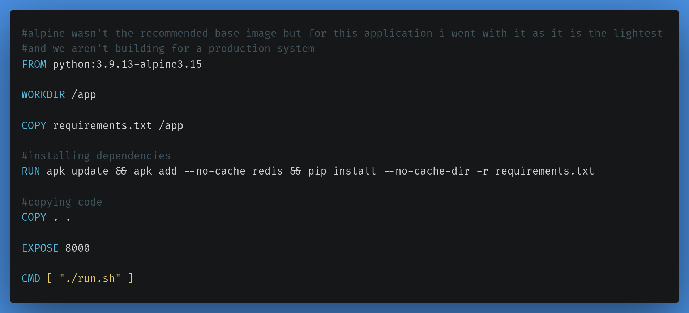
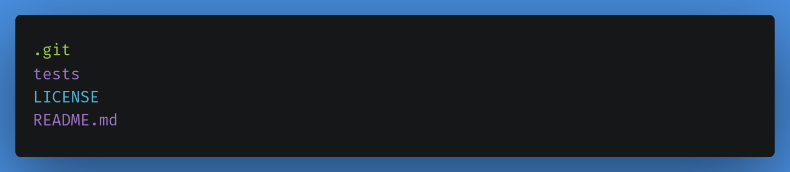
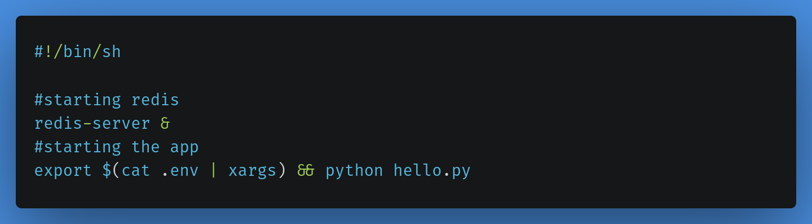

# Python reload counter helm chart

## Description

- This project was made as a lab for helm course.
- It is a simple reload counter made using tornado the python framework and redis.

## Steps

1. Cloned the app code from https://github.com/tradebyte/DevOps-Challenge
2. Created a Dockerfile for the image  

3. Created .dockerignore file to ignore unimportant files from getting containerized  
  
4. Created run.sh the startup script in the docker image  

5. Built the image `docker image build -t reload-count-tornado-py-app:v1.0.2alpine .`
6. Tagged the image `docker tag reload-count-tornado-py-app:v1.0.1alpine alaaamin/reload-count-tornado-py-app:v1.0.1alpine`
7. Pushed the image to dockerhub `docker push alaaamin/reload-count-tornado-py-app:v1.0.1alpine` [Docker hub](https://hub.docker.com/r/alaaamin/reload-count-tornado-py-app)
8. Created the helm chart `helm create reload-counter`
9. Created the chart, values file, deployment and service templates.

## Requirments

1. Docker running on a linux os. or if you're using windows or MacOS you need it configured to run linux containers
2. minikube or kubernetes. [minikube installation](https://minikube.sigs.k8s.io/docs/start/)
3. helm installed on your machine [installion steps](https://helm.sh/docs/intro/install/)

## To fire it up

1. clone this project to your pc
2. open a terminal
3. run `helm install release-name project-path` replace the release-name with whatever you want  
and project-path with the correct project path on your pc or simply open the terminal in the same  
directory and put a . (dot) as the project path
4. in the terminal run `minikube service release-name-reload-counter --url`  
replace release-name with your release name to get the url of the service
5. type the url into your browser and voila! everything should be working now

## Author

[Alaa A. Amin](https://www.linkedin.com/in/alaaamin-swe/)